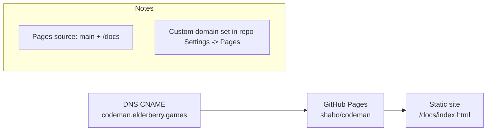

# GitHub Pages: codeman.elderberry.games

```mermaid
flowchart LR
  D[DNS CNAME\ncodeman.elderberry.games] --> G[GitHub Pages\nshabo/codeman]
  G --> S[Static site\n/docs/index.html]

  subgraph Notes
    N1[Pages source: main + /docs]
    N2[Custom domain set in repo Settings -> Pages]
  end
```
